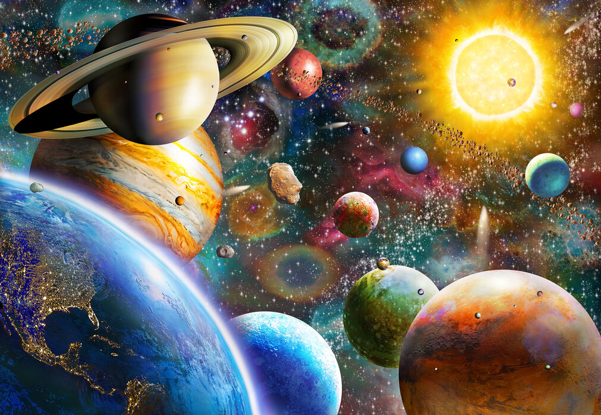

# Art-Transfer: Neural Style Transfer using VGG16 and VGG19

This project demonstrates Neural Style Transfer, a method of creating a new image by combining the **content** of one image with the **style** of another, using deep learning.  
It uses pretrained **VGG16** and **VGG19** convolutional neural networks to extract and blend features from two images. (Using **VGG16** and **VGG19** pretrained on **Imagenet** dataset)

## Table of Contents

- [About](#about)
- [How It Works](#how-it-works)
- [Examples](#examples)
- [References](#references)

## About

**Art-Transfer** applies the concept of Neural Style Transfer by:

- Extracting **content features** from a content image.
- Extracting **style features** (Gram matrices) from a style image.
- Iteratively updating a target image to match the desired content and style.

The models used are:
- **VGG16** (from torchvision models)
- **VGG19** (from torchvision models)

## How It Works

1. Load a pretrained VGG model (convolution layers only).
2. Extract:
   - **Content features** from deeper layers (e.g., `conv4_2`).
   - **Style features** from shallower layers (e.g., `conv1_1`, `conv2_1`, etc.).
3. Initialize the target image as a copy of the content image.
4. Define loss:
   - **Content Loss**: Mean squared error between content and target features.
   - **Style Loss**: Mean squared error between Gram matrices of style and target features.
5. Optimize the target image to minimize the total loss.

## Examples

| Content Image | Style Image | Result |
|:-------------:|:-----------:|:------:|
|  |  |  |

## References

- [A Neural Algorithm of Artistic Style — Gatys et al. (2015)](https://arxiv.org/abs/1508.06576)
- [PyTorch Transfer Learning Tutorial](https://pytorch.org/tutorials/beginner/transfer_learning_tutorial.html)
- [Gatys_Image_Style_Transfer_CVPR_2016_paper](https://www.cv-foundation.org/openaccess/content_cvpr_2016/papers/Gatys_Image_Style_Transfer_CVPR_2016_paper.pdf)
